# The Animal Association Game

The Animal Association Game is a fun educational game aimed at children between the ages of 4 and 7. The aim of the game is to match the animals to their preferred habitat and avoid selecting the wrong animals.

There are four habitats to choose from; farm, jungle, safari and sea. For each habitat there are two levels; easy and hard. The game is designed to be fun and engaging with the use of bright colourful imagery.

This game is a great way to teach kids about the different habitats that animals live in whilst also improving memory and picture recognition.

The live link can be found here - [Animal Association Game](https://aliokeeffe.github.io/The-Animal-Association-Game/)

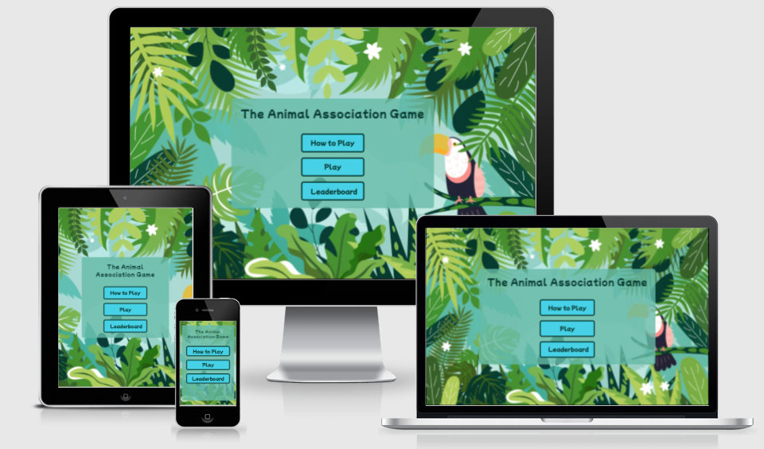

## Site Owner Goals
- To provide the user with an easy to navigate game that is both fun and educational.
- To present the user with a website that is visually appealing and fully responsive.
- To allow the user to choose from a selection of habitats and also to let them increase the level of difficulty of the game if they wish.
- Invoke a sense of urgency to complete the game as quick as possible. 
- To entice the user to return to the game to improve their score.

## User Stories

- ### First Time User
  - As a first time user I want to understand the main purpose of the game
  - As a first time user I want to be able to intuitively navigate the game, choose my level of difficultly, choose a habitat, play the game, see my score and restart the game once it ends.
  - As a first time user I want to have fun and learn about animals and their habitats

- ### Returning user
  - As a returning user I want to be able to play the same game without getting the same selection of animals.
  - As a returning user I want to be able to play a different game (different habitat).
  - As a returning time user I want to be able to save my score to to the leaderboard.

- ### Frequent user
  - As a frequent user I want to be able to increase the level of difficulty of the game.
  - As a frequent user I want to be able to beat my previous score on the leaderboard.

## Design

### Imagery
- The imagery and colour scheme of the site were both given careful consideration to ensure they compliment each other. The imagery used in the game is very important to the overall experience of the user. 
- Cartoon style imagery was chosen to give a playful feel to the site and to appeal to young children. 
- Given that that the game relates to animal habitats, a nature theme is consistently used across all imagery in order to tie in with the overall theme of the game. 

### Colour Scheme

Colour palette from Coolors

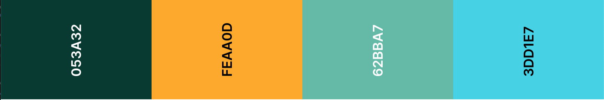

- The colour scheme of the site is mainly green and yellow with varying shades of green used to tie in with the nature imagery. The yellow chosen is happy and cheerful in order to be appealing for young children. 

- The color scheme of the site ties in with the main homepage image and the color picker Chrome extension was used to pull out the main colours as seen in the colour palette. These were then used throughout the site. 

- Great care was taken to establish a good contrast between background colours and text at all times to ensure maximum user accessibility.

### Fonts
The Poppins font is the main font used throughout the whole website. This font was imported via [Google Fonts](https://fonts.google.com/). The Mochiy Pop P One font is used for the main header and buttons to give a playful feel.  

Sans Serif is used as a backup font, in case for any reason the main font isn't being imported into the site correctly.

### Layout
The site is a single page with 6 sections:
  - Welcome area
  - How to play
  - Leaderboard
  - Game selection area
  - Play game
  - Game over and score

### Wireframes

Wireframes were produced using Balsamiq.

 

 
Desktop Wireframe

 

 

    
Mobile Wireframe

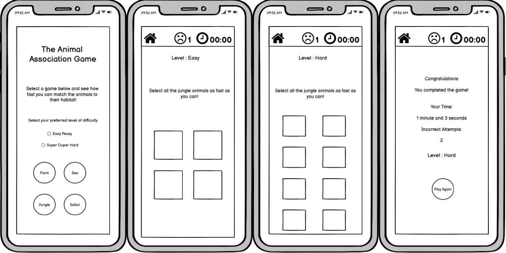
 

## Features

### Home Page

The landing page of the website has a very simple layout which includes the name of the game in large font and three large colourful buttons that are easy for kids to select. The user is given three options to choose from:
 - How to Play
 - Play
 - Leaderboard
 

 

### How to Play Page

If the user clicks the "How to Play" button the instructions section appears and the user can read the main rules of the game. The back button will take them back to the welcome area.

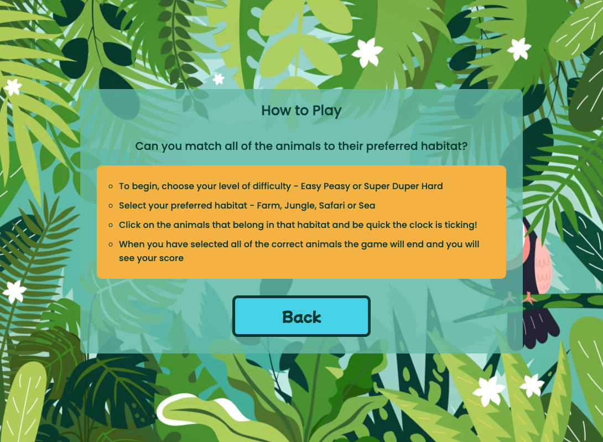

### Leaderboard

- The leaderboard section shows the player the three highest scores which have been saved. 
- All scores are saved in local storage so players can only compete with anyone who attempts the quiz on the same machine. 
- The score saved is the number of seconds taken to complete the game. (With the highest score being the least time taken)

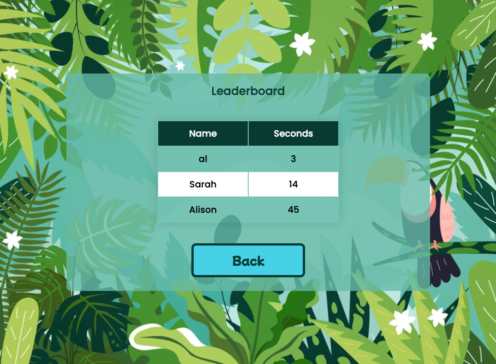

### Game Selection

- The are two levels of difficulty to choose from (easy and hard) and this option is presented as a radio button. 
- The default level selected is easy.
- The user can then choose from four habitats - each contains an object of different animals.

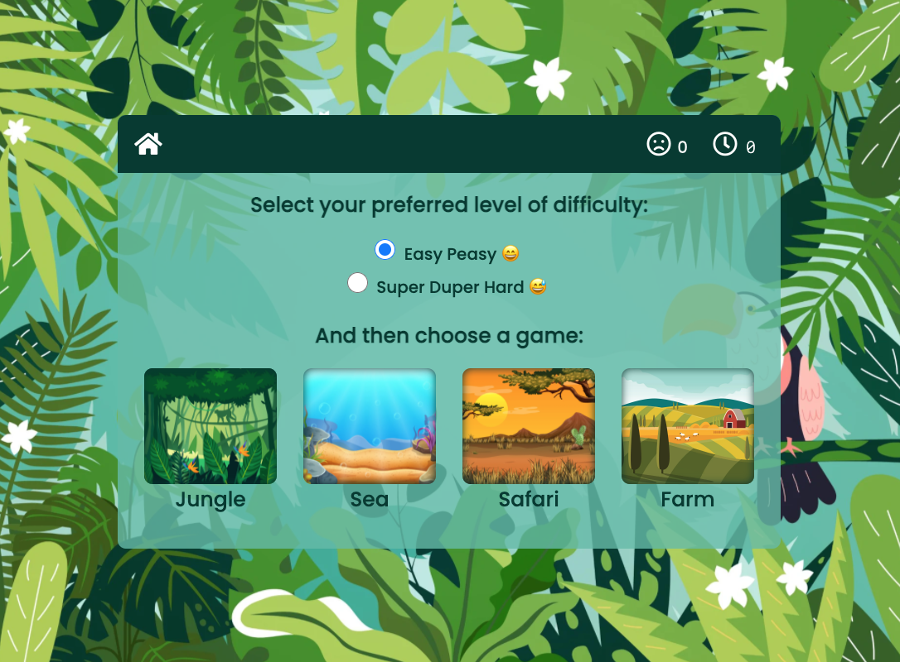

Mobile Game Selection

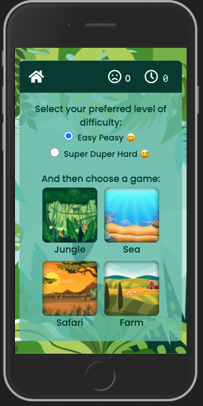

 

### Game Area

#### Easy Game

- The easy game includes four animal cards - three of which are correct answers and one incorrect.
- A different selection of cards is displayed each time a new game is started and the same card will never be duplicated in the same game.
- The background image changes to an image of the habitat selected and the habitat name is inserted into the heading text. 
- The information bar at the top of the game area include a counter for incorrect attempts and a timer function. 
- If the user selects a correct card it will turn green. If incorrect, the card will display a shake animation.
- When the user clicks on the last correct card the timer stops, the game ends and the game over area appears.

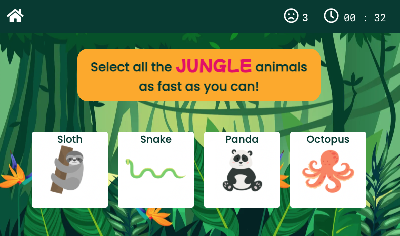

 
Mobile Easy Game

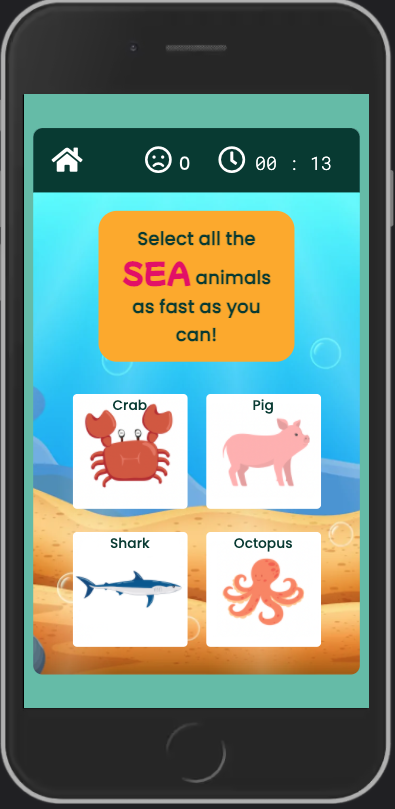

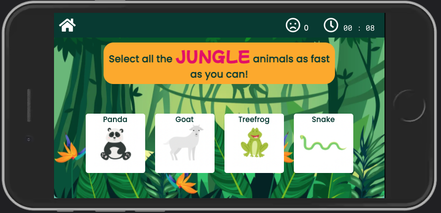

 

#### Hard Game

- The hard game includes eight animal cards - five of which are correct answers and three incorrect.

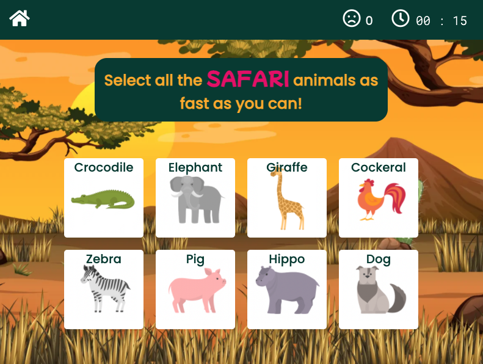

 
Mobile Hard Game

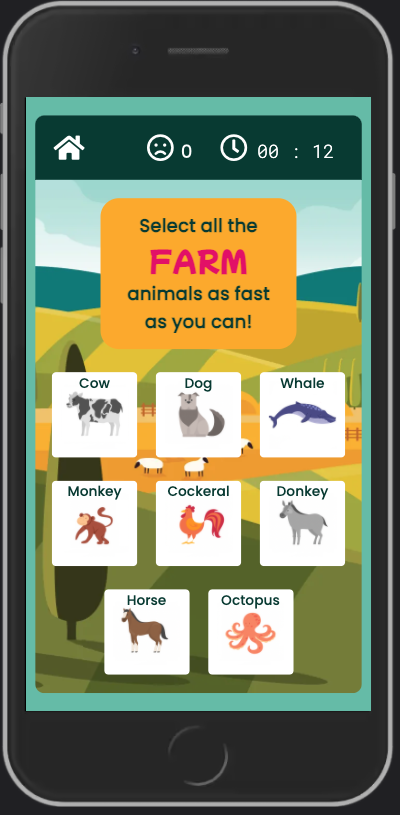

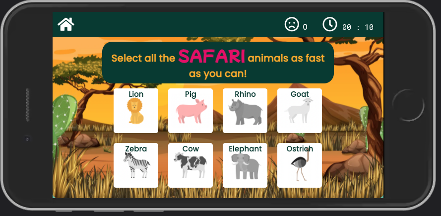

 

### Game Over
- The section shows the players score which inludes their time, number of incorrect attempts and level played.
- The player has an option to insert their name into the text input box and save their score to the leaderboard using local storage. 
- If no name is entered the user will be unable to save the score and a red border and shake animation will appear on the text input. 
- If the username is entered correctly the user will be taken directly to the leaderboard page.

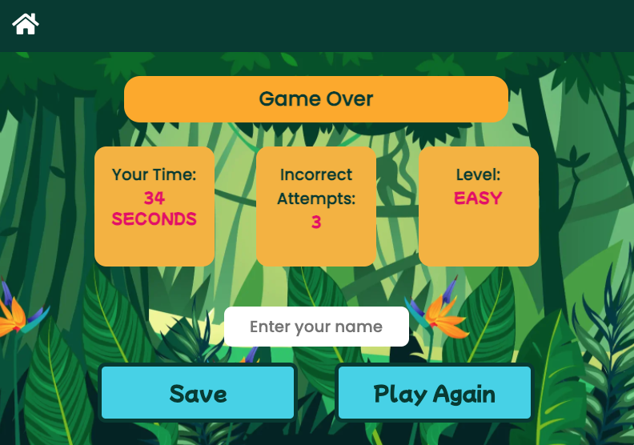

### Features Left to Implement
- Email JS to signup to newsletter

## Testing

### Validator Testing
- #### HTML
    - No errors were returned when passing through the official W3C Markup Validator
        - [W3C Validator Results](https://validator.w3.org/nu/?doc=https%3A%2F%2Faliokeeffe.github.io%2FThe-Animal-Association-Game%2F)
- #### CSS
    - No errors were found when passing through the official W3C CSS Validator 
        - [W3C CSS Validator Results](https://jigsaw.w3.org/css-validator/validator?uri=https%3A%2F%2Faliokeeffe.github.io%2FThe-Animal-Association-Game%2F&profile=css3svg&usermedium=all&warning=1&vextwarning=&lang=en)
- #### Javascript
    - No errors were returned when passing through the the [JSHint Validator](https://jshint.com/)

    INSERT SCREENSHOT

- #### Accessibility 
    - The site achieved a Lighthouse accessibility score of 100% which confirms that the colours and fonts chosen are easy to read and accessible

    INSERT SCREENSHOT

### Input Testing
- The username text input has been tested to ensure it won't save to the leaderboard unless text is inputted into the field.
- The leaderboard was tested to ensure that scores are saved in the correct order (quickest time first) and that only three scores are shown.

### Button Testing
- All buttons were tested manually to ensure the user is directed to the correct section of the website and functions run as intended.

### Game Testing
- The game was thorougly tested by friends and family to ensure that everything worked as intended:
  - Correct and incorrect animal cards were shuffled.
  - The same animal card didn't appear twice in the same game. 
  - The game shows a different selection of cards each time its played.
  - The game ends once all the correct animals have been selected.
  - The correct score is shown once the game ends.

### Browser Testing
- The Website was tested on Google Chrome, Firefox, Microsoft Edge, Safari browsers with no issues noted.
    
### Device Testing
- The website was viewed on a variety of devices such as Desktop, Laptop, iPhone 8, iPhoneX and iPad to ensure responsiveness on various screen sizes in both portrait and landscape mode. The website performed as intended. The responsive design was also checked using Chrome developer tools across multiple devices with structural integrity holding for the various sizes.
- I also used the following websites to test responsiveness:
    - [Responsinator](http://www.responsinator.com/?url=https%3A%2F%2Faliokeeffe.github.io%2FThe-Animal-Association-Game%2F)
    - [Am I Responsive](http://ami.responsivedesign.is/?url=https%3A%2F%2Faliokeeffe.github.io%2FThe-Animal-Association-Game%2F)

### Fixed Bugs

#### SetTimeout() method on incorrect cards
- When the user selects an incorrect animal during the game a shake animation CSS rule is added to the animal card using click listener. 
- When testing the game I noticed that once the card has been clicked once, the shake animation didn't fire on subsequent clicks. 
- In order to fix this I added the setTimeout() method to call a function to remove the CSS class after half a second (sufficient time for the animation to finish). This meant that for subsequent incorrect clicks, the shake animation rule could be added to card again meaning that the card shakes each time it is clicked.

#### Making a Deep Clone of an Object
- In order avoid having duplicated animals showing in a game, each time an animal card is written to the DOM it is spliced out of the animals object. In order to avoid altering the original animals object I needed to first make a clone of the object and splice the animals out of the new object instead. 
- To do this, I first used the spread operator however I quickly noticed that I was not getting the results I expected and the original object was still being changed when I spliced the cloned object. 
- Upon researching this I realised the issue was that my animals object was actually a nested object. When you have a nested object and you copy it, nested objects inside that object will not be copied Therefore, if you change the nested object, you will change it for both instances.
- To fix this I had to make a deep clone of the nested object by stringifying the object and parsing it right after - JSON.parse(JSON.stringify(a)). The following article was very useful : [How to differentiate between deep and shallow copies in JavaScript](https://www.freecodecamp.org/news/copying-stuff-in-javascript-how-to-differentiate-between-deep-and-shallow-copies-b6d8c1ef09cd/)
